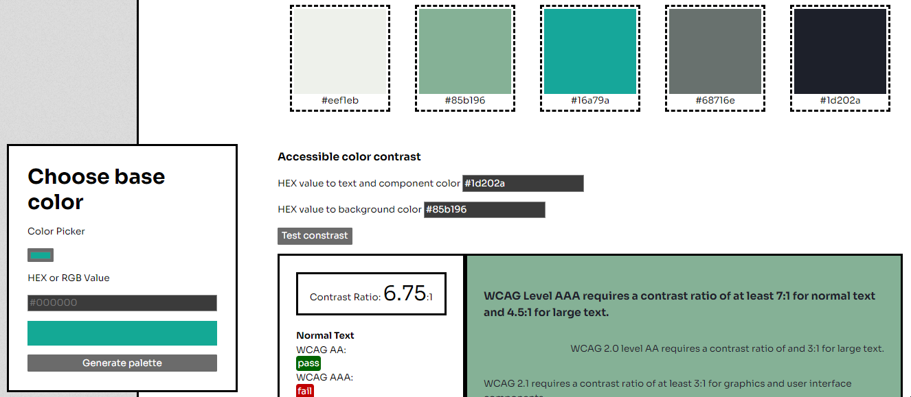

# Color Palette Generator and Contrast Checker

[See website](https://palettecontrast.netlify.app/)

## About
A website to solve a real problem (of mine): a one-stop palette maker and color contrast checker for accessibility. 

[Colormind](http://colormind.io/)'s UI mode takes generates matching colors from a base input. The resulting palette will have the lightest and darkest colors on the left and right ends, respectively, which makes it easier to come up with colors for a project. Each color will also have its HEX value appended for ease of copy.

To visualize how the colors might look against each other, adding HEX values (complete with #) to the text or background inputs will automatically color the test div.

Finally, clicking the "Test contrast" button will take those values, check the contrast between them, and then classify them as "Pass" or "Fail" according to Web Content Accessibility Guidelines (WCAG). 

## Next steps?
- Generate a random palette if no base color has been selected.
- Lock one or more favorite colors and generate a new palette around them.
- Export palette as CSS.
- Save palettes.
- Possibly move from Colormind API to Huemint's, for extra customization possibilities to the palette generator.

## APIs/Resources used:
- NodeJS proxy: [Cors Anywhere](https://cors-everywhere.herokuapp.com/)
- Palette generator: [Colormind](http://colormind.io/api-access/)
- Color contrast checker: [WebAIM](https://webaim.org/resources/contrastchecker/)
